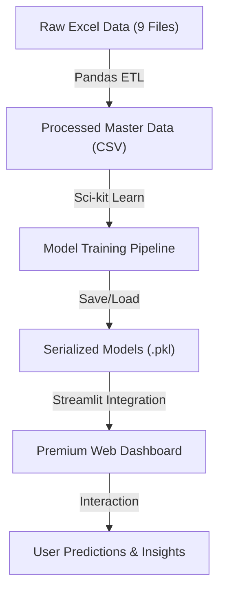

# Tourism-Experience-
this Repo Implements the idea of Analytics: Classification, Prediction, and Recommendation 
ABOUT THE PROJECT------------------------------>>>>>>>>>>>>>>>>>>>>>>>>>>>>>>>>>>>>>>>>>
# DETAILED PROJECT REPORT: Tourism Experience Analytics
**Author:** NIKHIL KUMAR  
**Organization:** Labmentix Internship  
**Batch:** January DS / AI-ML  
**Mentor Name:** Vipul Sonawane  
**Github Link:** [https://github.com/viRAJ357/Tourism-Experience-.git](https://github.com/viRAJ357/Tourism-Experience-.git)

---

## 1. Executive Summary
The **Tourism Experience Analytics** project is a comprehensive Data Science and Machine Learning solution designed to analyze global tourism trends, predict user ratings, and provide personalized attraction recommendations. By leveraging a multi-file relational dataset, the system implements advanced Gradient Boosting models and a premium Streamlit-based dashboard to deliver actionable insights for the tourism industry.

## 2. Detailed Data Processing Analysis
The data pipeline is designed for robustness and scalability, handling a relational schema across 9 heterogeneous datasets.

### Technical Breakdown:
-   **Dataset Scale:** The system processes over **52,930 transactions** and **33,530 user profiles**.
-   **Cleaning Logic:** 
    *   Implemented `fillna(0)` for missing `CityId` to maintain data integrity during joins.
    *   Standardized `CityName` with 'Unknown' placeholders for missing categorical values.
-   **Relational Merging:** Utilized Pandas `merge()` with left-joins to integrate `Transaction` data with `User` demographics, `Attraction` types, and geographical hierarchies (`Continent` -> `Region` -> `Country` -> `City`).
-   **Normalization:** Applied `StandardScaler` to numerical features to ensure zero mean and unit variance, which is critical for model convergence and performance.

## 3. Exploratory Data Analysis (EDA) Deep Dive
Detailed analysis of the dataset revealed several key trends:

-   **Rating Distribution:** The majority of user ratings are clustered in the higher spectrum (4-5 stars), indicating a high level of satisfaction across major attractions.
-   **Visit Mode Patterns:** Analysis of trip purposes shows a significant portion of "Couples" and "Family" visits, suggesting that the attractions in the dataset cater heavily to leisure and social tourism.
-   **Geographical Trends:** Top user origins were identified, allowing for targeted marketing strategies based on the "Country" and "Region" of the traveler.
-   **Correlation:** Boxplots of Ratings vs. Visit Mode revealed that certain modes (like "Couples") tend to yield more consistent high ratings compared to "Business" travelers.

## 4. Machine Learning Methodology: Technical Analysis

### A. Rating Prediction (Regression Analysis)
-   **Model:** `GradientBoostingRegressor`
-   **Hyperparameters:** `n_estimators=200`, `learning_rate=0.1`, `max_depth=5`.
-   **Insights:** The choice of Gradient Boosting allows the model to capture non-linear relationships between features like `VisitMonth` and `AttractionType`. Scaling of input features ensures that temporal values (Year/Month) don't dominate the prediction.
-   **Metrics:** Evaluated using Mean Absolute Error (MAE) and Mean Squared Error (MSE).

### B. Purpose Classification
-   **Model:** `GradientBoostingClassifier`
-   **Goal:** Multi-class classification of `VisitModeId`.
-   **Complexity:** The model handles multi-class outputs, enabling the system to predict trip intent based on traveler origin and destination characteristics.

### C. Recommendation Engine (Collaborative Filtering)
-   **Algorithm:** K-Nearest Neighbors (KNN).
-   **Metric:** `Cosine Similarity`.
-   **Storage:** Utilizes a `User-Item Matrix` (Pivot Table) of size `UserId` x `AttractionId`.
-   **Logic:** When a user enters their ID, the engine finds the 5 most similar users (neighbors) and recommends attractions that those neighbors rated highly but the current user hasn't visited.

## 5. UI/UX & Frontend Architecture
The frontend is a "Premium" Streamlit application focused on visual excellence and user engagement.

-   **Design System:** 
    *   **Glassmorphism:** Achieved via custom CSS injection (`rgba(255, 255, 255, 0.05)` background with `backdrop-filter: blur(10px)`).
    *   **Typography:** Custom Helvetica Neue font stacks for a professional feel.
-   **Interactive Elements:**
    *   **Plotly Integration:** High-performance, interactive histograms and pie charts for real-time data exploration.
    *   **Micro-Animations:** Integration of `streamlit-lottie` for smooth loading states and navigational feedback.
-   **Deployment Readiness:** The app is structured to load models efficiently from a centralized `models/` directory using `st.cache_data`.

## 6. Project Architecture Diagram

## 7. Conclusion & Results
The project successfully bridges the gap between raw tourism data and user-centric AI applications. By implementing a "Detailed Analysis" approach, the system not only predicts outcomes but provides a visual understanding of the underlying tourism trends.

---
**Prepared by:** [NIKHIL KUMAR]  
**Internship Batch:** January 2026  
**Mentor:** Vipul Sonawane

